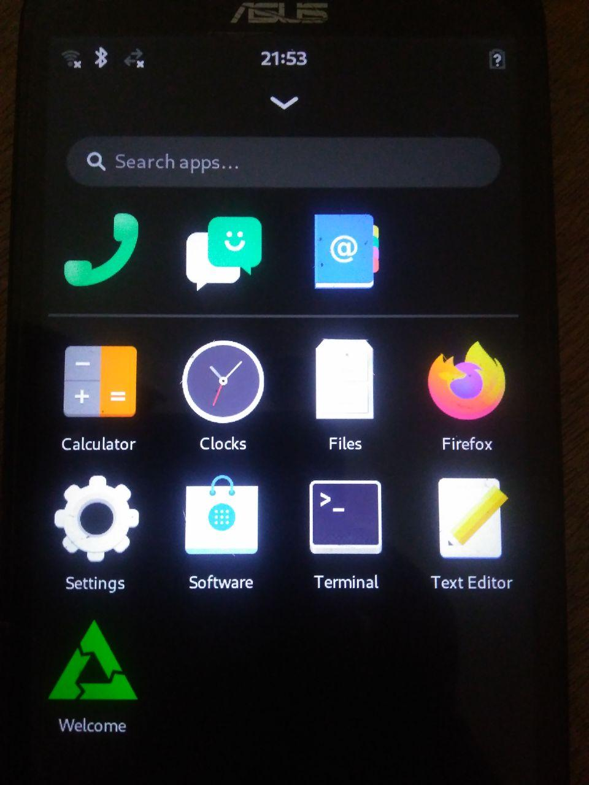

<p align="center">
    <br>
</p>


# postmarketos-asus-z00l [WIP]
Configuration files for compiling postmarketSO in Asus Zenfone 2 Laser. Eventually a mainline.


# Remove Powered by Android on Splash


You simply have to flash the splash.img with fastboot from the stock fastboot.

```
 $ # Reboot device into fastboot mode
 $ fastboot flash splash splash.img
 $ fastboot reboot # enjoy your postmarketOS logo.
```

**IMPORTANT**: If you make your own splash.img, Please make sure you don't use more than 5 MiB which is a hard limit.

If you want to make one yourself, See https://forum.xda-developers.com/zenfone-2-laser/general/guide-how-to-change-boot-logo-splash-t3526217

In linux you might want to start the script like this(instead of using the batch file),

```
 $ # Install wine 
 $ wine bin/Python2.7/python2.7.exe bin/Asus_Zenfone_Selfie_Splash_Maker_Utility.py  
```

**SIDE NOTE**: I used wine because the python script depends on PIL(the discontinued one), So to get things done we are doing this.

# A Note on using Wifi in Mainline

You have to create symbolic link ```/lib/firmware/wlan/prima/WCNSS_qcom_wlan_nv.bin``` pointing to the file ```/lib/firmware/wlan/prima/WCNSS_qcom_wlan_nv_ze550kl.bin``` or the one which suits your model.

Also execute the down below command.

```
 $ sudo -s # Needs super user.
 $ echo 1 > /dev/wcnss_wlan
 $ exit
 $ ifconfig # Now you should see wlan0, it might take some time to show up.
```

# Unlocking Bootloader in 2020

Since Asus dropped support for this model. The official unlocking will not work at all.
There is a simple way to unlock the bootloader but before that you should go to the device page
[here](https://www.asus.com/Phone/ZenFone-2-Laser-ZE550KL/HelpDesk_BIOS/) and download the latest firmware(1.7 GiB).

See the official site on how to install this firmware via OTA. 
```
TL;DR

Copy the downloaded ZIP file to your internal storage and reboot the phone. 
Now after reboot you should have notification saying that there is an update, click that
notification and follow the instructions.
```

**Warning: Please don't attempt to flash the system or boot while your device bootloader is locked, Only update to latest firmware through OTA.**


Before you continue make sure you have **Developer Mode enabled** and also **USB Debugging** is Enabled in the developer mode.

Also make sure to install adb and fastboot. The tradition android tools. If you are on linux it's
 fairly easy. 

> *I don't judge people just because they use Windows but I really don't like giving tutorials for Windows users. Get to linux ASAP before postmarketOS*

After updating your firmware to the latest. Now we are going to flash TWRP to recovery.

**IMPORTANT NOTE: The recovery in Asus Zenfone 2 Laser ZE550KL is not locked by default but 
your device might be different. So please don't continue if your model is not Asus Zenfone 2 Laser ZE550KL | Asus Z00L / Z00LD | ZE550KL. You have been warned.**

Now connect your device to your computer via USB. Now execute the following,

```
 $ adb devices
```

The above command should list your device.

Before you continue please download [this](https://github.com/antony-jr/postmarketos-asus-z00l/releases/download/binary/ASUS_unlock_Z00T_Z00L.zip) from the releases. You don't require this file for now but download it, we need it later.

Also download TWRP for this device from [here](https://twrp.me/asus/asuszenfone2laser720p.html).

**IMPORTANT NOTE: After executing the following commands below, You have to hold your power button
 and volume down key soon after reboot. Only press it until you see your asus logo. If you miss this and your phone boots normally then you have to repeat this entire process and also execute the down below commands once again.**

Now execute the following command,

```
 $ adb reboot bootloader
 $ fastboot flash recovery twrp.img # change twrp.img to the downloaded TWRP img.
 $ fastboot reboot
```

**Now you should be in TWRP recovery, follow instructions from TWRP and do the default.**

Once you finish setting up TWRP recovery, boot into your recovery usually done by powering off and press and hold volume down and power button release once you see the Asus Logo.

**IMPORTANT NOTE: Please turn off screen locking from settings in TWRP Recovery.**

**IMPORTANT NOTE: Make a backup of your Asus Stock ROM using TWRP backup. If you don't have
enough space in your device. Use a OTG USB to store your backup in a thumb drive. Make sure it is formated for android. Also make sure to turn off screen locking from settings because if screen locks the backup fails for some reason. Reduce the brightness to minimum to avoid battery wastage.**

Now that you have backed up everything if something goes wrong, unless you mess your partition you can recover by going into TWRP recovery and recover with the backup file to stock rom. If it's in USB OTG then select that storage.

Now Download [SuperSu.zip](https://download.chainfire.eu/1220/SuperSU/SR5-SuperSU-v2.82-SR5-20171001224502.zip/), from your computer transfer it to your phone via TWRP recovery. (You have usb support when your in TWRP Recovery)

Now install this SuperSu.zip via TWRP Recovery -> Install. **Also wipe your cache after installing**. Usually this will be done with no issues. But if you run into problems and your phone won't boot recover with your backup. And refer about the problem in xda forums.

Now reboot to your stock android. Now your device should be rooted. And you should have Super Su App which can verify the root status.

**IMPORTANT NOTE: Before continuing, connect your device with your pc and verify if it is available via adb**.

Now unzip the file you [downloaded](https://github.com/antony-jr/postmarketos-asus-z00l/releases/download/binary/ASUS_unlock_Z00T_Z00L.zip) and run the ```unlock_bootloader.sh``` shell script.

When asked for root access in the phone, Accept it.

**Thats it now your bootloader should be unlocked. After the process finishes, do the following to verify the unlocked bootloader status**.

```
 $ adb reboot bootloader
 $ fastboot oem device-info # It should say Bootloader: unlocked
 $ fastboot reboot
```


